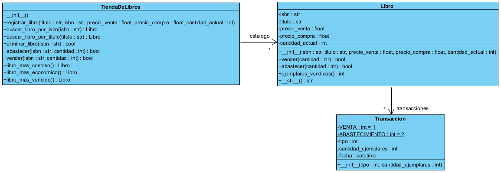

# Tienda de Libros
Esta es una aplicación usada para la evaluación de seguimiento del curso de
Algoritmos y Programación Orientada a Objetos en python. La idea de 
la evaluación es completar la implementación de una aplicación de una tienda de libros.

El código de la aplicación se encuentra incompleto. La idea es completarlo por medio de las
respuestas a los puntos de la evaluación.